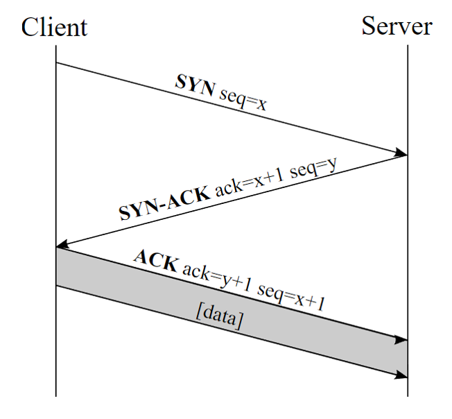

1.北京大学某单位的某台机器IP地址为162.105.80.160，子网掩码为255.255.255.192

1）该单位的网络号（网络+子网）是多少

将IP地址和子网掩码转换成二进制，再进行按位与操作即可：

10100010 01101001 01010000 10100000

&

11111111 11111111 11111111 11000000

↓

10100010 01101001 01010000 10000000

↓

162.105.80.128

2）该单位理论上可容纳多少主机

10100010 01101001 01010000 10000000，去除网络号后还剩6位，因此可容纳2^6−2=62台主机（减2是因为全0作为网络地址，全1作为广播地址）

3）北大可以有多少个这样的子网（假定北大全部都是162.105网段）

将网络号拆分为网络+子网：

|网络号|子网号|主机号|
|:-:|:-:|:-:|
|1010 0010 0110 1001|0101 0000 10|00 0000|

子网位数共10位，因此总共可以有2^10=1024个这样的子网。

注：理论上，子网部分全0和全1是可以的，但是一些老的网络设备不支持这个特性，因此一些同学减去这两个地址也是可以的，即1022也是对的。

2.解释TCP协议建立连接为什么设计为三步握手？

用通俗的话来讲：

Client告诉Server：我想和你通信，我给你发了一个x，收到请回复

Server告诉Client：我收到了你的x，我给你发了一个y，收到请回复

Client告诉Server：我收到了你的y，我们可以开始通信了

要确定Client和Server都能成功地发送和接受消息，至少需要且仅需要三次连接。

3.有哪些恶意软件，如何防范恶意软件？

恶意软件：

- 特洛伊木马
- 蠕虫
- 计算机病毒
- 间谍软件
- 广告软件
- 流氓软件（浏览器劫持、强制安装等）
- …其他合理答案皆可

防范方法：

- 安装杀毒软件(有些杀毒软件也流氓，一般windows defender就够了)

- 不下载运行不知名网站的软件

- 其他合理答案

